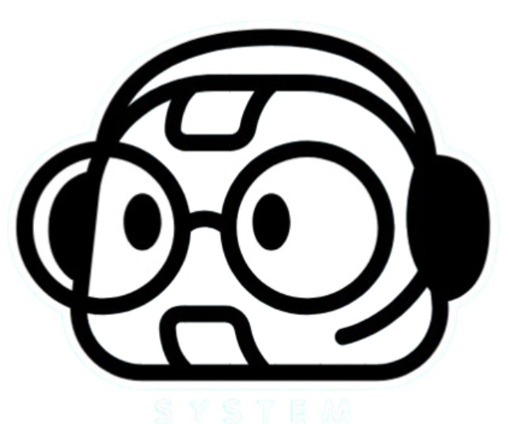

<p align="center">
  
</p>

<h1 align="center">AI Operating System</h1>

<p align="center">
  A browser-based AI Operating System built with React, TypeScript, Electron, and SQLite.
</p>

## Features

- **Desktop Environment** - Full desktop with icons, wallpaper, and context menus
- **Window Manager** - Drag, resize, minimize, maximize, and close windows
- **Taskbar** - Running applications, system tray, clock, notifications
- **Start Menu** - Application launcher with search and categories
- **File Manager** - Browse, create, rename, delete files and folders
- **Terminal** - Command line interface with basic filesystem commands
- **Notes** - Create, edit, search, and organize notes with tags
- **Calculator** - Basic arithmetic with history and keyboard support
- **Calendar** - Month/week/day views with event management
- **Task Manager** - Task tracking with priorities and due dates
- **App Store** - Browse and install applications
- **Settings** - Appearance, system, privacy, and AI configuration
- **System Monitor** - CPU, memory, disk usage with real-time charts
- **AI Assistant** - Chat interface with Ollama integration
- **Global Search** - Search across apps, files, and content
- **Notifications** - Toast notification system
- **Dark/Light Theme** - Customizable appearance with accent colors

## Tech Stack

- **Frontend**: React 18, TypeScript, Vite, Tailwind CSS
- **Desktop**: Electron 28
- **State**: Zustand
- **Icons**: Lucide React
- **Database**: SQLite (better-sqlite3)
- **AI**: Ollama (optional)

## Project Structure

```
ai-operating-system/
├── frontend/          # React frontend
│   ├── src/
│   │   ├── apps/      # Application components
│   │   ├── components/# UI components
│   │   ├── stores/    # Zustand stores
│   │   ├── hooks/     # Custom hooks
│   │   ├── styles/    # Global styles
│   │   └── types/     # TypeScript types
│   └── package.json
├── electron/          # Electron main process
│   ├── main/
│   │   ├── main.ts    # Main process entry
│   │   ├── preload.ts # Preload script
│   │   └── ipc/       # IPC handlers
│   └── package.json
├── database/          # SQLite schema and migrations
├── shared/            # Shared types and utilities
├── public/            # Static assets (logo.png)
└── package.json       # Root package.json
```

## Installation

```bash
# Install dependencies
npm run install:all

# Or install separately
cd frontend && npm install
cd ../electron && npm install
```

## Development

```bash
# Start frontend dev server
cd frontend && npm run dev

# Start Electron (after frontend is running)
cd electron && npm run dev

# Or start both
npm run dev
```

## Building

```bash
# Build frontend
npm run build:frontend

# Build Electron app
npm run build:electron

# Build everything
npm run build
```

## Database

The application uses SQLite for persistent storage. On first run:

```bash
# Run migrations
npm run db:migrate

# Seed with sample data
npm run db:seed
```

## AI Assistant (Ollama)

The AI assistant works in offline mode by default. For real AI responses:

1. Install Ollama: https://ollama.ai
2. Start Ollama: `ollama serve`
3. Pull a model: `ollama pull llama3`
4. The app will automatically detect Ollama

## Configuration

Environment variables (`.env.example`):

```env
OLLAMA_ENABLED=true
OLLAMA_HOST=http://localhost:11434
OLLAMA_DEFAULT_MODEL=llama3
```

## Keyboard Shortcuts

| Shortcut | Action |
|----------|--------|
| Ctrl/Cmd + K | Global search |
| Ctrl/Cmd + Shift + T | Open terminal |
| Ctrl/Cmd + N | New item |
| Alt + Tab | Switch applications |
| Escape | Close menus/dialogs |
| Ctrl/Cmd + S | Save |

## Security

- Context isolation enabled
- Preload scripts for IPC
- No direct Node.js access in renderer
- Validated IPC inputs
- Safe filesystem operations

## License

MIT